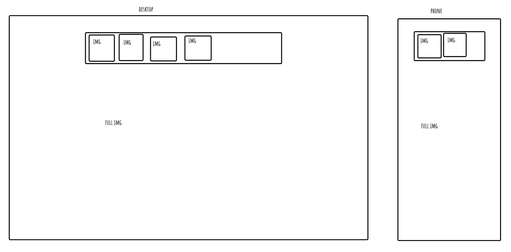

# week 2 assignment

## Reflection

- basic requirements

  - i have meet all goals
  - finding out how overflow works helped a lot
  - geting the tabbig to work was ease as well
    

- stretch goals
  - i added multiple media queries
  - i added srcset to all images

## References

- i use okso.app to help make a layout
- all my images of my cats
- i used w3schools to find how to get the div to be true center
- i used w3schools to find out how to do overflow
- i used stack overflow to ge tabbing to work
